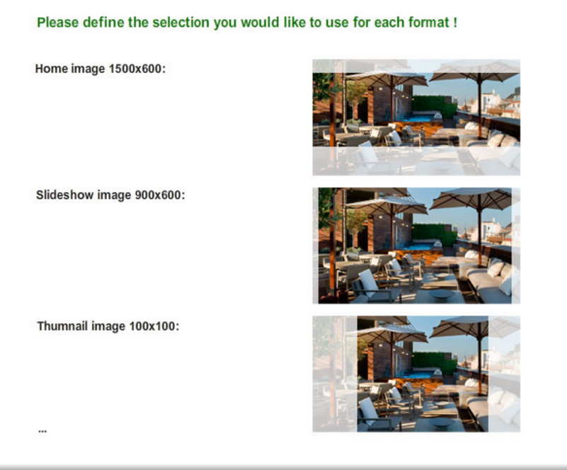

# [Image Crop Plugin](http://github.com/mrazvan92/image-crop-plugin)

A simple jQuery image cropping plugin.



# Features


# Getting started

## Installation

Include files:

```html
<script src="/path/to/jquery.js"></script><!-- jQuery is required -->
<link  href="/path/to/image-crop.css" rel="stylesheet">
<script src="/path/to/image-crop.js"></script>
```

## Usage

```html
<div class="crop-main">
    <div style="width: 600px; height: 300px;" class="crop-container">
        
    </div>
</div>
```

```javascript
$(".crop-main").imageCrop();
or
$('.crop-main').imageCrop({
    offsetLeft: 20,
    offsetRight: 30,
    offsetTop: 20,
    offsetBottom: 50
});

```

